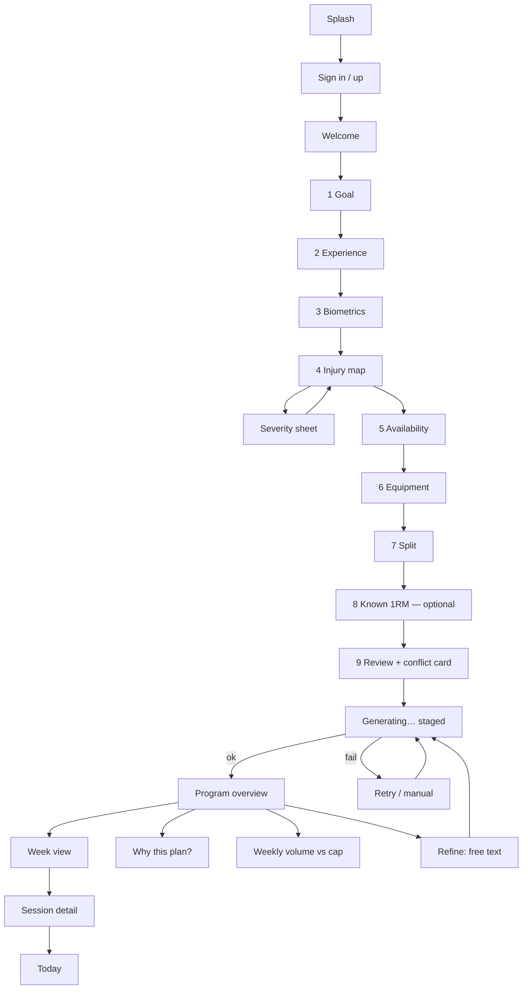
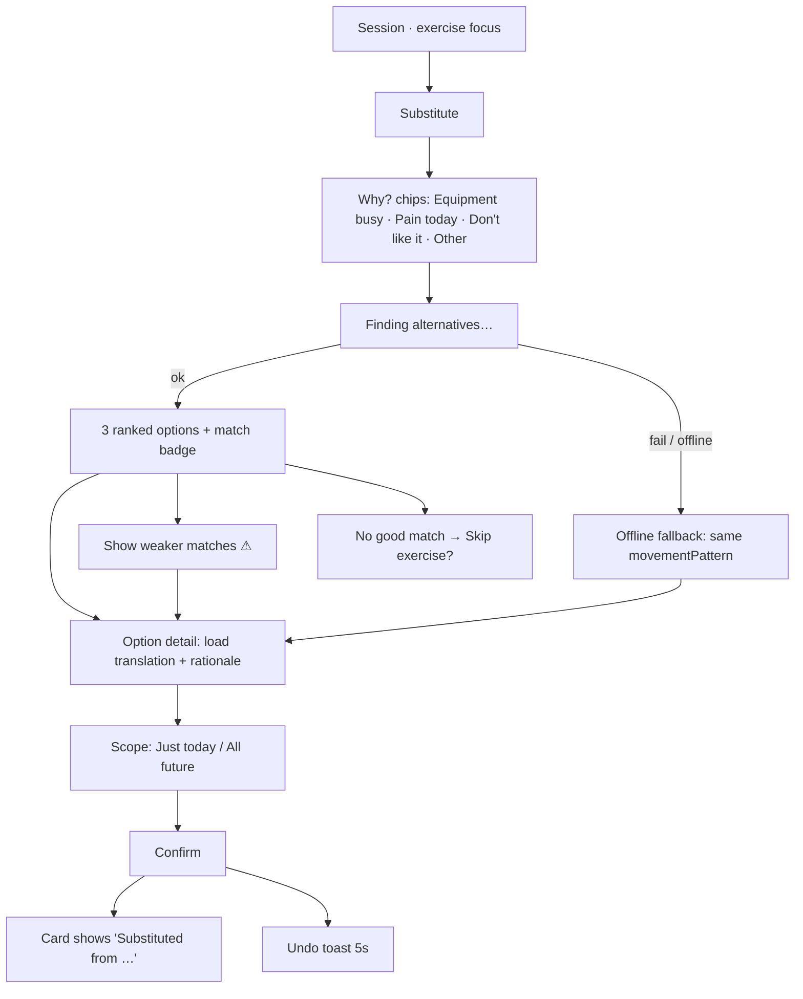
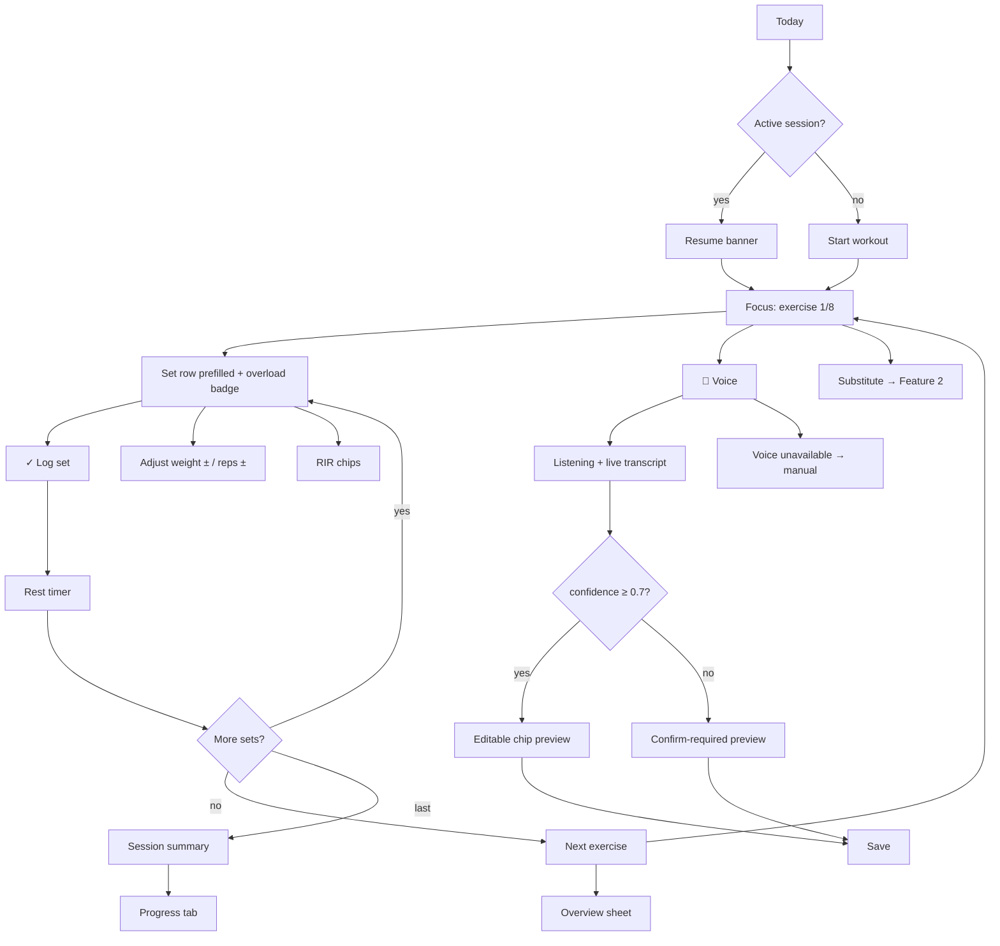

# Wireframe Brief — Design Decisions & Screen Specification

> Locked design decisions, screen inventory, flows and low-fi wireframes for the Gym AI MVP.
> Read before drawing screens or building UI.
>
> **Companion docs:** [`../AGENTS.md`](../AGENTS.md) (engineering rules) ·
> [`DOMAIN-RULES.md`](DOMAIN-RULES.md) (training science & AI logic)
>
> **Status:** alignment complete · pre-build · last updated 2026-07-28

---

## 1. Source Material

**File:** `Immersive Design - AR.pdf` — journey board, one page, flattened image export.
Post-its represent one app screen each.

### Machine-readable content

- Title: **Wireframes & Design**
- **Creación de perfil de usuario** → *Onboarding* → "Definir cuáles son los datos que se van
  a capturar en este caso" → ✅ resolved in §3.1
- **Dashboard de estadísticas** — *(pendiente de definición)* → ✅ resolved in §3.5
- **Constructor de rutina → Wizard de rutina**
  - Paso 1: Objetivo (hipertrofia, grasa, resistencia)
  - Paso 2: Nivel de experiencia (ajuste de la intensidad inicial)
  - Paso 3: Mapeo de lesiones (selecciona zonas afectadas en mapa interactivo)
  - Paso 4: *truncated* — begins "(Di… y…" → assumed **Disponibilidad y equipamiento**
- Flow annotation with an arrow returning to Paso 1: *"Cambio e…"* → assumed
  **Cambio de ejercicio**

### ⚠️ Extraction limitation

Only the top-left lane is recoverable from the PDF. The **substitution** and **statistics
dashboard** lanes could not be read. Everything specified for those lanes (§3.4, §3.5) is
**derived from the alignment conversation, not from the board.** To reconcile, provide
per-lane PNG crops, the Miro/Figma link, or transcribed post-it titles.

---

## 2. Global Decisions

| Item | Decision |
|---|---|
| Platform | Mobile-first PWA · primary canvas **390 × 844** |
| Theme | **Dark primary** — gyms are low-light |
| Navigation | Bottom tabs: **Today · Program · Progress · Profile** |
| Landing | "Today" screen with a large Start-workout CTA |
| i18n | **English default, full Spanish parity** — budget **+35% label width** for ES |
| Auth | Placeholder screen only; detailed later (Phase 1) |
| Ergonomics | All primary session actions in the **bottom third** (thumb zone) — hard constraint |
| Accessibility | Tap targets **≥ 48 px**; high-contrast numerals legible at arm's length |
| Empty first run | Single full-width "Create your routine" card |
| Fidelity | Low-fi for flows → mid-fi for hero screens (Shadcn-accurate) |

**Why dark + thumb zone + large numerals:** the primary usage context is standing at a rack,
phone in one hand, mid-set, reading at arm's length. Every layout decision serves that.

---

## 3. Feature Specifications

### 3.1 Onboarding data captured — FINAL

```
Goal            hypertrophy | fat_loss | endurance | strength     single-select
Experience      beginner | intermediate | advanced                → sets volume cap
Biometrics      sex, age, height, bodyweight, units(kg|lb)        BW drives load translation
Injuries        zone[] × severity(mild|moderate|severe) + note    → restrictedPatterns[]
Availability    daysPerWeek 2–6, minutesPerSession 30/45/60/75/90 → exercise count cap
Equipment       preset(commercial|home|bodyweight) + checklist    → filters exercise pool
Preferred split full_body | upper_lower | ppl | no_preference     soft input; AI may override
Known 1RM       squat / bench / deadlift                          OPTIONAL, skippable
```

**Injury map:** front/back silhouette toggle, ~10 tappable zones (knee, lower back, shoulder,
elbow, wrist, hip, neck, ankle, + others), 3-level severity, free-text note.
`restrictedPatterns` stays internal — surfaced read-only inside the AI rationale.

**Equipment:** 3 presets + a "customize" expander with a detailed checklist.

**Known 1RM:** accepts a **best set** (weight × reps) and converts via Epley — see
`DOMAIN-RULES.md` §4.4. "I don't know" is the default state.

#### Two consequences that require dedicated screens

**① Split conflict card** (screen 12)
A preferred split can violate the 48–72 h recovery rule. PPL at 3 days/week hits each muscle
1×/week instead of 3×. The Review step surfaces a soft-conflict card:

> *"You chose Push/Pull/Legs, but at 3 days/week Full Body trains each muscle 3× instead of 1×.
> We recommend Full Body."* → `[Use Full Body]` / `[Keep my choice]`

The user keeps agency; the app keeps its integrity.

**② Calibration week** (screen 22)
If 1RM is skipped, Week 1 becomes a calibration week: the session UI shows
*"Find your working weight"* instead of a prescribed load, and the Progress baseline is taken
from Week 1 actuals.

### 3.2 Routine generation & output

- **Wait state:** full-screen staged progress — *Analyzing injuries → Balancing volume →
  Building Week 1.* Doubles as a demonstration of the AI's reasoning
- **Week view is the hero:** Mon–Sun chips with split labels → tap a day → session detail
- **Mesocycle:** collapsed banner — "Program: 8 weeks · Accumulation phase"
- **Weekly volume vs. cap:** bars with cap markers
- **Rationale:** collapsed "Why this plan?" accordion + an always-visible one-line summary
- **MVP editing:** accept or regenerate (with a free-text refinement field) + per-exercise
  substitute. **No** manual add/reorder

### 3.3 Active session — FINAL

- **Focus mode:** one exercise per screen + collapsible session-overview sheet
- Set rows **prefilled** from predicted load + last session → the common case is **one tap** on ✓
- Steppers: weight ±2.5, reps ±1
- **RIR** chip row 0–4 with plain-language labels; **required on the last set** of each
  exercise, optional on earlier sets. **RPE hidden in MVP**
- Progressive-overload badge: *"↑ +2.5 kg — you left 2 RIR last time"*
- Minimal inline **rest timer**, auto-starting after each logged set (notifications → Phase 3)
- **Voice:** mic FAB → listening sheet with live transcript → editable chip preview →
  Save / Try again. Confidence < 0.7 opens the preview with fields highlighted for confirmation.
  Explicit "voice unavailable" fallback (Web Speech API gaps on iOS/Safari)
- **Mid-session exit:** session stays `active`; Today shows *"Resume workout — 4 of 8 exercises"*
- **Completion summary:** tonnage, sets, duration, PRs, per-muscle volume added this week,
  next-session teaser
- **Deload warning:** dismissible, non-blocking alert card on Today

### 3.4 Substitution — FINAL

> Derived from conversation, not the board — see §1 limitation.

- **Entry points:** active session (primary) and routine preview
- **Reason chips first:** Equipment busy · Pain today · Don't like it · Other.
  One extra tap, large gain in suggestion and rationale quality
- **3 ranked options**; match shown as a **label + colored badge** ("Excellent match"),
  raw score only in the detail view
- **< 0.5 confidence:** hidden behind "Show weaker matches ⚠"; plus a
  *"No good alternative found — skip this exercise?"* empty state
- **Load translation is the hero:** explicit before → after row with an expandable
  "How we calculated this" showing the arithmetic
- **Explicit Confirm** + 5 s Undo toast; the card then carries a persistent
  *"Substituted from Barbell Bench Press"* subtitle (`substitutedFrom`)
- **Scope toggle:** "Just today" (default) vs. "All future sessions"
- **Offline / API failure:** rule-based fallback list filtered by the same `movementPattern`
  — gym signal is unreliable; later backed by pgvector

### 3.5 Progress dashboard — FINAL

> The board marked this *pendiente de definición*. Specified here.

**Requirement:** programs have an end date (e.g. 3 months). The hero must clearly show
strength progress across that window, where **both** more reps at the same load **and** more
load at the same reps count as progress.

**Solution:** plot **estimated 1RM (Epley)** — it absorbs both dimensions.
See `DOMAIN-RULES.md` §4.4 for the formula and worked numbers.

**Chart spec**
- Headline: **"+12% average strength gain since Week 1"**
- X axis = program weeks 1 → N (fixed duration), with a `▲ today` marker
- **Dashed projection to the program end date** — gives the fixed program a visible finish line
- View toggle: **`% change` (default)** · `Absolute kg` · `Volume`
- Default series = squat / bench / deadlift · `[+ Add lift]` for others
- Tooltip **must show raw set notation**, the Week-1 comparison, and a plain-language delta
  ("+3 reps at the same load")
- **Break the line** for weeks a lift wasn't trained — never interpolate a gain that didn't happen

**Below the hero, in priority order**
1. Weekly sets per muscle group vs. cap (bars + cap marker), with a **body-heatmap toggle**
   reusing the injury-map silhouette asset
2. Total tonnage trend (line, last 8 weeks)
3. Personal records list (best e1RM / best set per exercise)
4. Adherence (sessions completed vs. planned)
5. Current mesocycle position ("Week 3 of 8 — Accumulation")
6. History list (chronological past sessions, tappable to view logged sets)

---

## 4. Screen Inventory — 31 unique frames

### Auth & Onboarding (13)

| # | Screen | Notes |
|---|---|---|
| 1 | Splash | logo only |
| 2 | Sign in / up | placeholder, low detail |
| 3 | Welcome + value prop | 3 bullets, "Build my program" |
| 4 | Step 1 — Goal | 4 radio cards |
| 5 | Step 2 — Experience | 3 cards, each states its volume cap |
| 6 | Step 3 — Biometrics | sex, age, height, BW, unit toggle |
| 7 | Step 4 — Injury map | front/back silhouette, ~10 zones |
| 7b | Severity sheet | mild/moderate/severe + note |
| 8 | Step 5 — Availability | days 2–6, minutes chips |
| 9 | Step 6 — Equipment | 3 presets + customize expander |
| 10 | Step 7 — Preferred split | 4 options incl. "No preference" |
| 11 | Step 8 — Known 1RM | **optional**, accepts weight × reps, "I don't know" default |
| 12 | Step 9 — Review | editable summary + **split conflict card** |
| 13 | Generating | staged progress messages |

### Program (6)

| # | Screen | Notes |
|---|---|---|
| 14 | Program overview | mesocycle banner, one-line rationale |
| 15 | Week view | Mon–Sun chips with split labels — the hero |
| 16 | Session detail | exercise list, sets/reps, substitute affordance |
| 17 | Why this plan? | expanded rationale accordion |
| 18 | Weekly volume vs. cap | bars + cap markers |
| 19 | Refine | free-text field → regenerate |

### Session (7)

| # | Screen | Notes |
|---|---|---|
| 20 | Today | + resume-session variant |
| 21 | Exercise focus | the screen users live in |
| 22 | Calibration-week variant | when no 1RM was given |
| 23 | Voice listening | live transcript |
| 24 | Voice preview | low-confidence, fields highlighted |
| 25 | Rest timer | inline, auto-start |
| 26 | Session summary | tonnage, PRs, volume added, next-session teaser |

### Progress (3)

| # | Screen | Notes |
|---|---|---|
| 27 | Progress hero | strength progression chart |
| 28 | Volume + body heatmap | sets vs. cap, silhouette toggle |
| 29 | History list & session recap | chronological, tappable |

### Substitution (4)

| # | Screen | Notes |
|---|---|---|
| 30 | Reason chips | Equipment busy · Pain today · Don't like it · Other |
| 31 | Ranked options | 3 options + match badges |
| 32 | Option detail | load translation + rationale + scope toggle |
| 33 | Offline / no-match fallback | pattern-filtered list, or skip-exercise |

### Cross-cutting (2)

| # | Screen | Notes |
|---|---|---|
| 34 | Empty first run | single "Create your routine" card |
| 35 | Deload alert card | dismissible, non-blocking, on Today |

*Numbering reaches 35 because of the `7b` sub-sheet and variant states; **31 unique frames**.*

---

## 5. Flow Diagrams

### Feature 1 — Onboarding → Routine



### Feature 2 — Real-time substitution



### Feature 3 — Session, logging & voice



---

## 6. Key Wireframes

### Screen 27 — Progress hero

```
┌─────────────────────────────────────────────┐
│  Program · Week 8 of 12          [•••]      │
│                                             │
│      +12%                                   │
│      average strength gain since Week 1     │
│                                             │
│  kg                              ╭──● Squat │
│ 100│                        ╭────╯     +8%  │
│    │                  ╭─────╯               │
│  90│●─────╮─────╭─────╯      ╭──────● Bench │
│    │      ╰─────╯      ╭─────╯         +11% │
│  80│            ╭──────╯                    │
│    │      ╭─────╯            ╭───────● Dead │
│  70│●─────╯            ╭─────╯         +17% │
│    └──┬──┬──┬──┬──┬──┬──┬──┬──┬──┬──┬──┐   │
│       1  2  3  4  5  6  7  8  9 10 11 12   │
│                          ▲ today  ╎ target ╎│
│                                             │
│  [ % change ] [ Absolute kg ] [ Volume ]    │
│                                             │
│  ─── tap a point ─────────────────────────  │
│  │ Squat · Week 8                         │ │
│  │ 3 × 9 @ 75kg    e1RM 97.5kg   ↑ +8.3%  │ │
│  │ Week 1 was 3 × 6 @ 75kg (e1RM 90kg)    │ │
│  │ +3 reps at the same load               │ │
│  └────────────────────────────────────────┘ │
└─────────────────────────────────────────────┘
```

### Screen 11 — Known 1RM (optional)

```
┌───────────────────────────────────────┐
│ ←            ●●●●●●●●○○        Skip → │
│                                       │
│ Do you know your maxes?               │
│ Optional — helps us set Week 1 loads  │
│ precisely. Skip it and Week 1 becomes │
│ a calibration week instead.           │
│                                       │
│ Back squat                            │
│ ┌───────────────┐  ┌────────────────┐ │
│ │        │  kg  │  │ I don't know ✓ │ │
│ └───────────────┘  └────────────────┘ │
│ Bench press                           │
│ ┌───────────────┐  ┌────────────────┐ │
│ │        │  kg  │  │ I don't know   │ │
│ └───────────────┘  └────────────────┘ │
│ Deadlift                              │
│ ┌───────────────┐  ┌────────────────┐ │
│ │        │  kg  │  │ I don't know   │ │
│ └───────────────┘  └────────────────┘ │
│                                       │
│ ⓘ Best set works too — enter 100kg×5  │
│   and we'll estimate your 1RM.        │
│                                       │
│         [    Continue    ]            │
└───────────────────────────────────────┘
```

### Screen 21 — Exercise focus

```
┌───────────────────────────────────────┐
│ ✕  Upper A · Exercise 2/8      ⌃ 24:31│
├───────────────────────────────────────┤
│ Barbell Bench Press                   │
│ push_horizontal · Chest, Front delt,  │
│ Triceps                               │
│ ┌───────────────────────────────────┐ │
│ │ ↑ +2.5 kg  You left 2 RIR last    │ │
│ │            time — going up.       │ │
│ └───────────────────────────────────┘ │
│                                       │
│ Set 1 ✓  10 × 80.0 kg      RIR 2      │
│ Set 2 ✓  10 × 80.0 kg      RIR 2      │
│ ╔═══════════════════════════════════╗ │
│ ║ Set 3        target 3×10          ║ │
│ ║   ⊖  80.0 kg  ⊕     ⊖  10  ⊕      ║ │
│ ║ RIR [0][1][ 2 ][3][4]  ← required ║ │
│ ╚═══════════════════════════════════╝ │
│                                       │
│ ═══ thumb zone ═════════════════════   │
│ ┌─────────────────────┐  ┌──────────┐ │
│ │      ✓ Log set      │  │    🎤    │ │
│ └─────────────────────┘  └──────────┘ │
│  ⇄ Substitute        Skip        Next │
└───────────────────────────────────────┘
```

### Screen 32 — Substitution option detail

```
┌───────────────────────────────────────┐
│ ←   Alternative                       │
├───────────────────────────────────────┤
│ Dumbbell Bench Press                  │
│ ● Excellent match  0.94               │
│ push_horizontal — same pattern ✓      │
│ Muscle overlap 92% ✓                  │
│                                       │
│ ┌─── Your load, translated ─────────┐ │
│ │  Barbell        →   Dumbbell      │ │
│ │  80 kg × 10         34 kg × 10    │ │
│ │  (bar)              per hand      │ │
│ └───────────────────────────────────┘ │
│ ⌄ How we calculated this              │
│   80 ÷ 2 = 40 kg per hand             │
│   ×0.85 for ~20% greater ROM          │
│   = 34 kg per hand                    │
│                                       │
│ Why this works                        │
│ Same horizontal press pattern and     │
│ near-identical muscles. Bench is      │
│ occupied; dumbbells are free and add  │
│ stability demand at a slightly lower  │
│ load.                                 │
│                                       │
│ Apply to                              │
│ ( ● Just today )( ○ All future )      │
│ Apply to                              │
│ ( ● Just today )( ○ All future )      │
│ ═════════════════════════════════════ │
│      [   Use this exercise   ]        │
└───────────────────────────────────────┘
```

---

## 7. Build Sequence

Agreed order for producing the coded wireframes:

1. **Onboarding** — screens 1–13
2. **Session focus + voice** — screens 20–26
3. **Substitution** — screens 30–33
4. **Progress** — screens 27–29
5. **Program** — screens 14–19

Rationale: onboarding produces the data every other screen consumes, and the session focus
screen carries the highest UX risk, so it gets reviewed early.

**Implementation notes**
- Mobile-first, dark theme, Shadcn + Tailwind
- EN/ES strings extracted from the start — retrofitting i18n is expensive
- Wireframes are runnable via `npm run dev` so they can be manually tested per
  `AGENTS.md` → Testing Instructions
- Use mock data at this stage; no live AI calls required to validate layout

---

## 8. Open Questions

### Source material

- [ ] The board's **substitution** and **statistics dashboard** lanes could not be extracted
      (flattened image). §3.4 and §3.5 come from the alignment conversation, **not the board.**
      Need per-lane PNG crops, a Miro/Figma link, or transcribed post-it titles to reconcile
- [ ] Wizard **Paso 4** is truncated ("Di… y…") — assumed *Disponibilidad y equipamiento*,
      split into two steps in §3.1. Confirm
- [ ] The arrow annotation *"Cambio e…"* is assumed to mean *Cambio de ejercicio*. Confirm
- [ ] The PDF is named *"Immersive Design - AR"*, which doesn't match Gym AI — likely a board
      template artifact. Confirm it's the correct export

### Product

- [ ] **Program completion (candidate screen 36)** — when Week 12 ends, proposal is a
      *Program Complete* screen showing total % gain per lift, feeding the next mesocycle's
      starting loads, with the finished program archived and shown as a faded chart series. Approve?
- [ ] **Calibration-week copy** — is *"Work up to a weight you could stop 2 reps short of"*
      the right framing, or should we prescribe a starting load derived from bodyweight and
      experience level?
- [ ] Final injury-zone list and labels (~10 zones assumed)
- [ ] Spanish copy — who owns translation and review?
- [ ] Does the Progress tab need a per-exercise drill-down in MVP, or is the PR list enough?

### Technical

- [ ] Chart library for the hero chart — Recharts vs. Visx vs. hand-rolled SVG
- [ ] i18n approach — `next-intl`, `next-i18next`, or a hand-rolled dictionary
- [ ] PWA scope — installable manifest and offline shell in MVP, or later?

---

*End of document.*